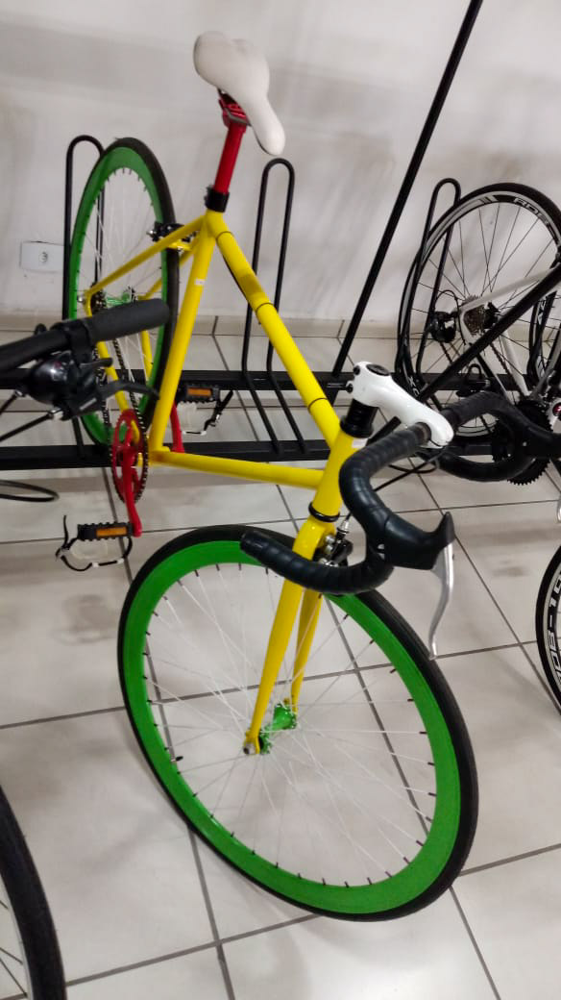
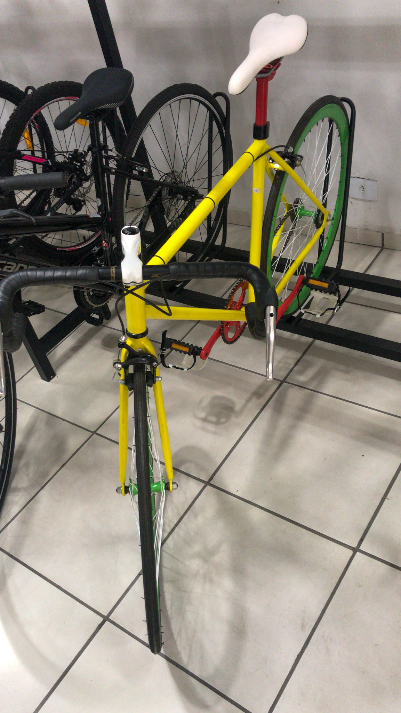
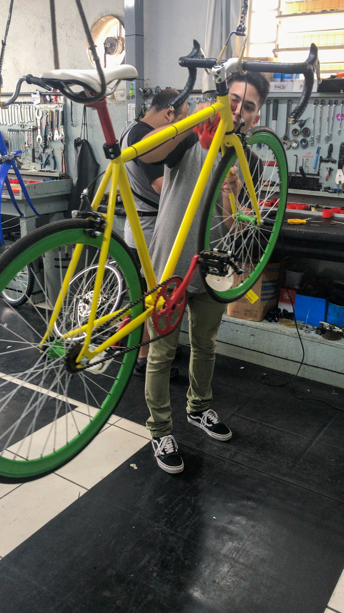
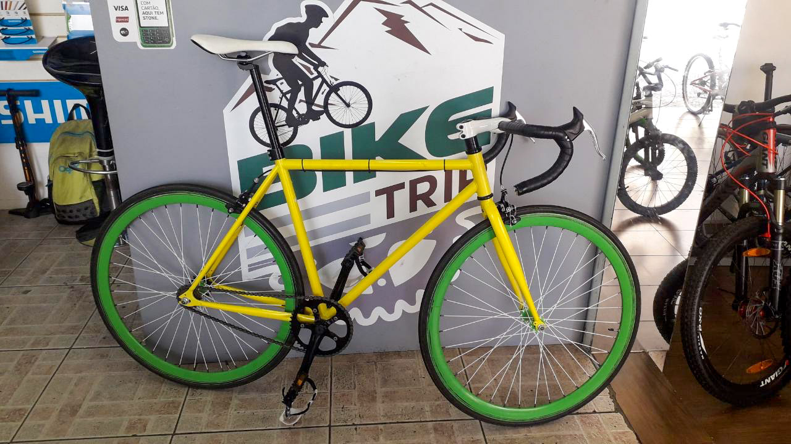
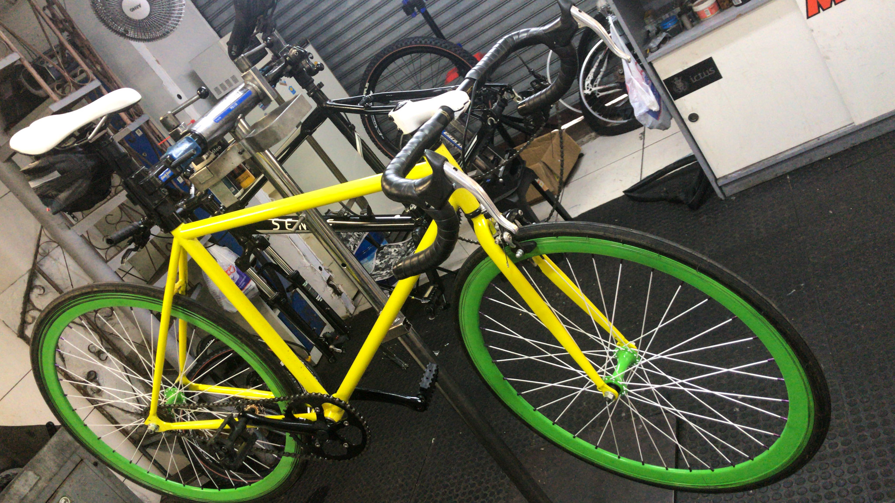
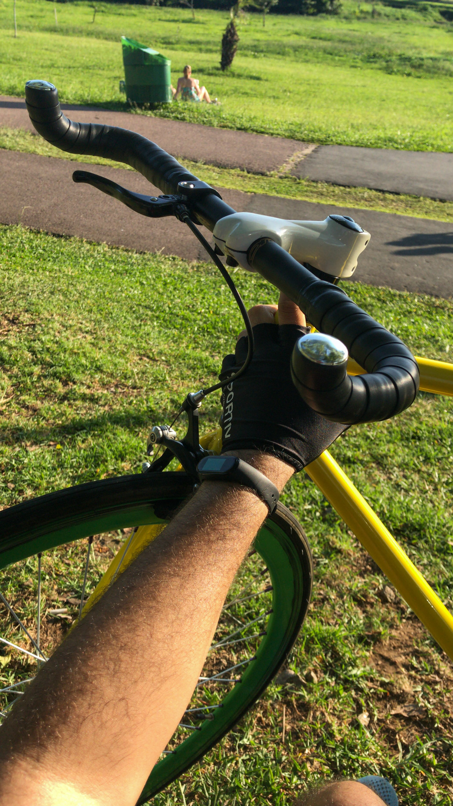

E aí rolezeiro! Tudo bom contigo?

Criei um blog (mais um) para falar um pouco sobre meus ~rolezins~ de bike fixa ⏤ conhecida como **_fixed gear_** ⏤ e outras coisas relacionadas.

Minha magrela se chama [**Rosanna**](https://open.spotify.com/track/37BTh5g05cxBIRYMbw8g2T), sim eu dei um nome pra minha bike, e sim é uma música de uma banda de rock chamada [**Toto**](https://open.spotify.com/artist/0PFtn5NtBbbUNbU9EAmIWF). Não precisa nem dizer que eu curto rock, gosto da banda e amo essa música né? hahahaha'

## A Compra

Inicialmente eu queria montar a minha própria bike, customizada com minha cara e personalidade, porém isso levaria muito tempo e eu não tava com muito saco para tal. Então resolvi buscar uma à venda na internet mesmo.

Encontrei vários modelos, usadas e novas, baratas e caras, mas nenhuma me conquistou a ponto de me fazer tirar o escorpião do bolso.

Encontrei um site de uma bicicletaria aqui perto de casa, a [Bike Portella](https://www.bikeportella.com.br/), que monta algumas bikes [single speed/fixas](https://www.bikeportella.com.br/c/bikes/bike-urbana/fixa/single-speed/139022-SIT.html), resolvi ir dar uma olhada pessoalmente.

Tinha apenas dois tipos de bikes, ambas single speed, com cubo flip-flop se quiser transformar em _fixed gear_. As cores não me agradaram nenhum pouco, era uma mistura de Copa do Mundo com show de horrores, a _"menos feia"_ era a ~amarelinha~, porém tinha rodas e cubos verdes, canote e pedivela vermelhos (WTF???)

Bem, resolvi que iria comprar ela.

## As primeiras customizações

Eu queria pintar logo (sério, nem é copa do mundo gente!), mas vou fazer isso aos poucos, o amarelo do quadro eu gostei, agora o vermelho do Canote e do Pedivela eu precisava arrancar, então pintei de preto.

Além da pintura do Canote e o Pedivela eu modifiquei mais algumas coisas na Rosanna, tirei o freio traseiro, removi o **firma pé** branco do pedal.

A mudança mais _dahora_ foi a do guidão, serrei ele e inverti, ficou parecido com um guidão **_bullhorn_** ⏤ porém menor ⏤ hahahaha'

## Fixa baby!!

Além de serrar o guidão e remover o freio traseiro eu queria muito virar o cubo flip-flop da Rosanna, e transformar ela numa **_Fixed Gear_**. Até então era **_Single Speed_** e estava suprindo, mas a minha lombriga estava me corroendo por dentro.

Depois que virei o cubo viciei! É um pouco perigoso, confesso, mas to gostando muito disso.

## Próximos passos (pedaladas)

O principal objetivo de ter comprado uma bike é porque eu amo muito motos e bicicletas, segundo motivo é sair do sedentarismo.

Eu quero não só ficar dando rolezins aleatórios no parque mas quero muito treinar com ela e quem sabe, [subir 25km de serra](https://www.glpromo.com.br/eventos-esportivos/6-desafio-serra-da-graciosa-de-ciclismo/84).

Aguarde cenas do próximo rolezin.

bye! :bicyclist:
