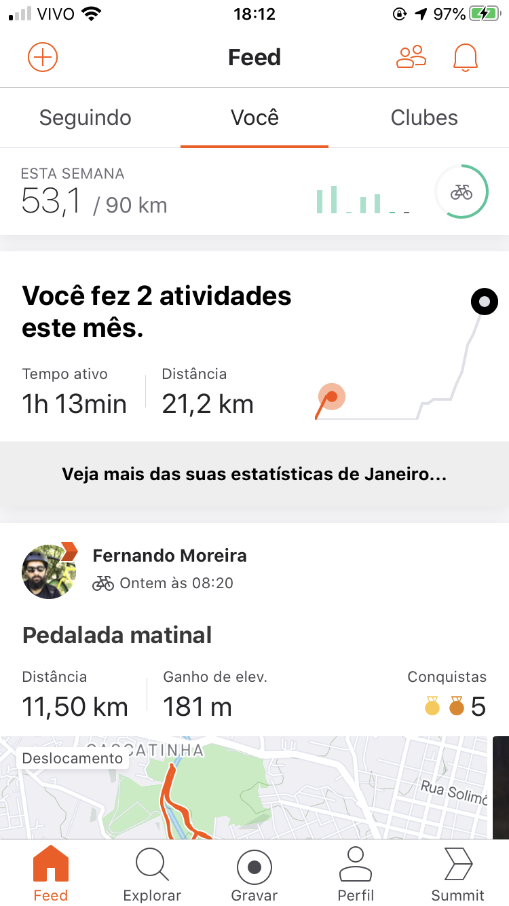
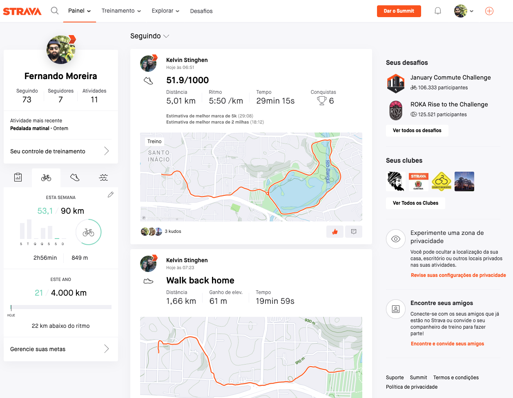
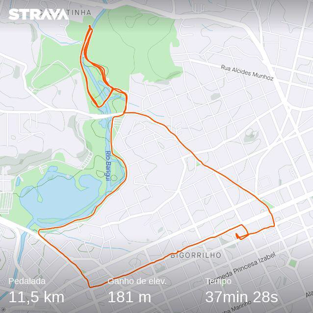
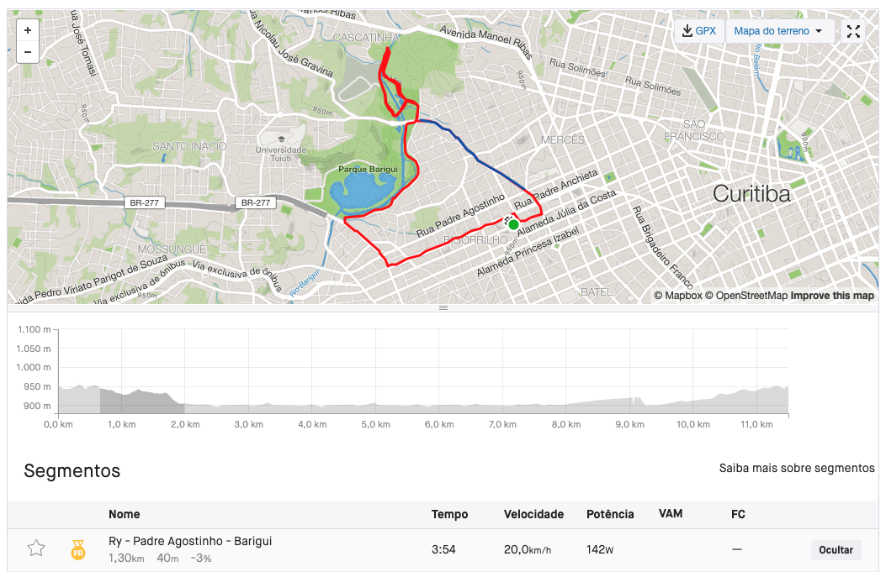
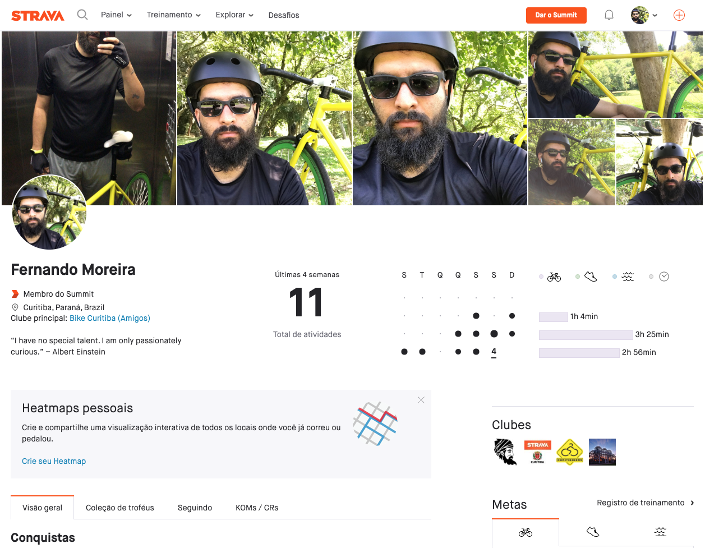
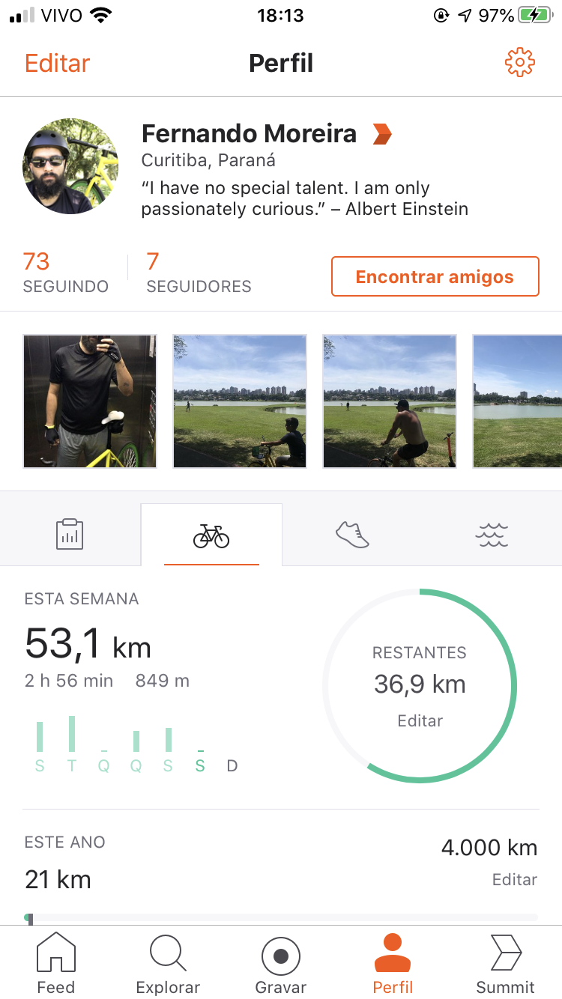

Se você é como eu, está iniciando no submundo dos treinos com sua magrela e caiu aqui atrás de um aplicativo **TOPIZERA** (me julgue), então você precisa conhecer o [**_Strava_**](https://www.strava.com/).

Daí você me pergunta: **"~Mas porque diabos eu usaria esse app Fernando?? 🤔"**. Vem comigo que eu respondo essa sua pequena grande dúvida.

## Uma ajudinha pra começar

Nesse começo árduo que está sendo (eu sei) o **_Strava_** vai te ajudar e muito, vai por mim!

Dúvida básicas como:

- **"Quanto (km) eu pedalei essa semana?"**
- **"Será que mais algum ciclista passou por aqui?"**
- **"Quanto tempo eu levei pra subir essa pequenina/enorme elevação aqui?"**

O **_Strava_** responde todas essas dúvidas com os dados no seu _feed_ de atividades, de seus amigos e todo atleta que deixar o seu _feed_ público.

## _Feed_ de atividades / _Dashboard_

No _feed_ você vai encontrar duas abas, a primeira são as atividades das pessoas que você está seguindo, depois as suas atividades e na sequencia as atividades das pessoas que participam dos mesmos clubes que você (justo não?).

No [navegador](https://www.strava.com/dashboard) nós temos uma visão mais ampla do aplicativo (_thanks pelo óbvio, jenius!_), temos mais dados, por isso chamam de _Dashboard_, o _feed_ fica no centro, com outras informações nas laterais do app.

## Siga, Curta, Compartilhe!

Mais do que um app, uma rede social de atletas!

O **_Strava_** vai além de só _trackear_ suas atividades, como outros apps na mesma linha (Google Fit, Mi Fit, etc), tem-se uma comunidade por trás fazendo acontecer, nada seria o **_Strava_** sem os atletas.

Eu achei _DUCARVALHO!_ saber que meus amigos andam fazendo atividades física, acompanhar de perto me da mais motivação para continuar. Mais feliz ainda em saber que alguns fazem um treino pesado e diário, vamos seguir o exemplo! hahahaha'

## Os Seguimentos

Logo acima tivemos essas duas dúvidas **"Será que mais algum ciclista passou por aqui?"** e **"Quanto tempo eu levei pra subir essa pequenina/enorme elevação aqui?"**.

Com os **[Seguimentos](https://www.strava.com/athlete/segments/starred)** no **_Strava_** conseguimos saber exatamente quanto tempo levamos nas elevações e se algum ciclista bateu ou passou perto do seu "recorde" pessoal.

Na imagem acima, o Seguimento da elevação da **Padre Agostinho**, eu fiz em **3:54** (péssimo eu sei, vou melhorar), na velocidade de 20km/h, isso me da um motivo bem palpável para treinar forte e bater meu recorde pessoal só nesse trecho.

## Um app completo

O **_Strava_** não é um app apenas para os cliclistas, pra quem corre e nada também!

Tem muita coisa pra falar do **_Strava_** ainda (é sério), mas vou para por aqui, e divir em pequenos posts falando de algumas funcionalidades que eu acho mais importantes.

E para encerrar, eu vou deixando aqui o meu perfil ([strava.com/athletes/oseunando](https://www.strava.com/athletes/oseunando)), me segue lá e veja por onde ando com minha **Engrenagem Fixa!**

Até! :bicyclist:
